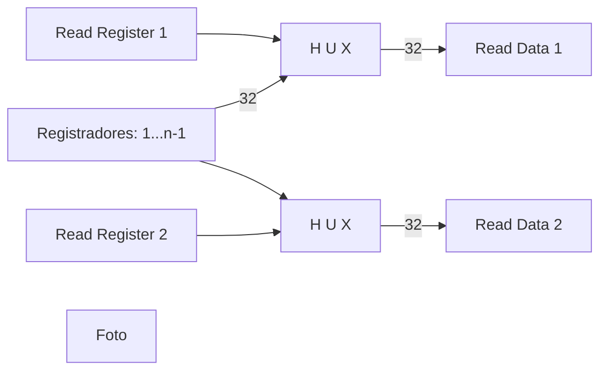

## Aula 10 - Arquitetura Mips

### Componentes da Arquitetura

* Registradores
	* Propósito geral
	* especificos
	* (PC, IR,...)

* UC
* ULA
* Memória
* E/S
---

### Implementações da Arquitetura

* Single Cycle (Monociclo)
	
	Um ciclo executa a instrução inteira

* MultiCycle (Multiciclo)
	
	Um ciclo executa 1 etapa da instrução
	

* Pipelined

	Um ciclo executa uma etapa da instrução e as etapas
	são sobrepostas
---

### Tempo de ciclo de clock

$$ Freq = 1/tempo cicloclock $$

Portanto, com a diminuição do tempo de ciclo, a freq aumenta

* 1 instrução - 4 etapas
	* Busca
	* Decodificação
	* Execução 1
	* Execução 2

---

#### Monociclo

|Instrução	|Tempo (quadrados de lousa)|
|---------------|-----------------------|
|1		|1-4 			|
|2		|5-8 			|
|3		|9-12 			|

#### Multiciclo

|Instrução	|Tempo (quadrados de lousa)|
|---------------|-----------------------|
|1		|1 (Busca)		|
|		|2 (Decodificação)	|
|		|3 (Execução 1)		|
|2		|4 (Busca)		|
|		|5 (Decodificação)	|
|		|6 (Execução 2)		|
|3		|7 (Busca)		|
|		|8 (Decodificação)	|
|		|9 (Execução 1)		|
|		|10 (Execução 2)	|

#### Pipelined

|Instrução	|Tempo (quadrados de lousa)			|
|---------------|-----------------------|
|1		|1 (Busca)		|
|		|2 (Decodificação)	|
|		|3 (Execução 1)		|
|		|4 (Execução 2)		|
|2		|2 (Busca)		|
|		|3 (Decodificação)	|
|		|4 (Execução 1)		|
|		|5 (Execução 2)		|
|3		|3 (Busca) &nbsp;	|
|		|4 (Decodificação)	|
|		|5 (Execução 1)		|
|		|6 (Execução 2)		|

---
### Banco de registradores

<!--stackedit_data:
eyJoaXN0b3J5IjpbMTA5MTU4Njg5MSwxODkzNDA4MDQsMjg0NT
c0MjEyLDE5MTkyMjkwMTcsLTE3MzY4NjUzNzUsLTIwODg3NDY2
MTJdfQ==
-->